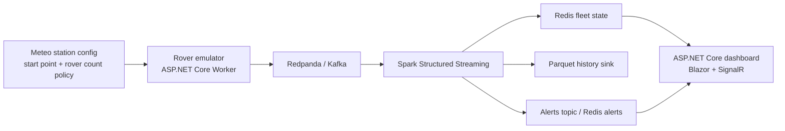

# Spark Learn

Small training MVP for building a containerized live telemetry pipeline with C#/.NET services, Kafka-compatible streaming, Spark Structured Streaming, Redis state, and a live dashboard.

## Exercise Goal

Build a fictional Trimble-style rover telemetry platform where one meteo station launches an unknown number of rovers from a shared `(lat, lon)` start point. Each rover moves independently with random heading and speed, drains its battery, emits live telemetry, samples air quality from a shared smooth spatial field, and eventually dies when its battery reaches zero.

The learner should be able to explain:

- why Spark streaming helps for event-time telemetry, state, deduplication, and alerts
- when Spark is overkill and an ASP.NET-only pipeline would be simpler
- how live events flow through a containerized system
- how the design maps to a geospatial backend problem
- how to reason about freshness, stateful alerts, and correlated spatial signals

## MVP Scope

- `rover-emulator`: ASP.NET Core Worker Service that emits GNSS/location, heading, speed, battery, and air-quality events for many rovers
- `redpanda`: Kafka-compatible local event bus
- `spark`: Spark Structured Streaming job that consumes telemetry, deduplicates events, derives state, and creates alerts
- `redis`: current fleet state and alert store
- `dashboard`: ASP.NET Core dashboard, for example Blazor or MVC + SignalR
- optional Parquet sink for historical replay and batch analysis

Spark may be attempted with .NET, but the training path should include a pragmatic JVM/Spark SQL fallback.

## Architecture



## Event Flow

1. The emulator launches rovers from a shared origin and emits events every 1-5 seconds.
2. Redpanda buffers and partitions telemetry, ideally by `roverId`.
3. Spark reads raw events, parses schema, applies watermarking and deduplication, and derives fleet state and alerts.
4. Spark writes current rover state to Redis and optionally writes history to Parquet.
5. The dashboard reads Redis or receives SignalR updates and renders fleet positions, path summaries, battery state, freshness, and alerts.

## Alerts

The product should highlight:

- dead rover
- low battery
- stale rover or missing recent telemetry
- communication gap
- impossible jump
- unhealthy air quality on the rover path

## Local Development

```bash
docker compose up --build
```

Dashboard:

- UI: http://localhost:8088
- Health: http://localhost:8088/health
- Fleet state API: http://localhost:8088/api/fleet/state
- Latest alerts API: http://localhost:8088/api/alerts/latest?take=20

This repository is intentionally small and tutorial-oriented. Keep the architecture .NET-centered for the emulator and dashboard, with Spark as the event-time and stateful-streaming component.
