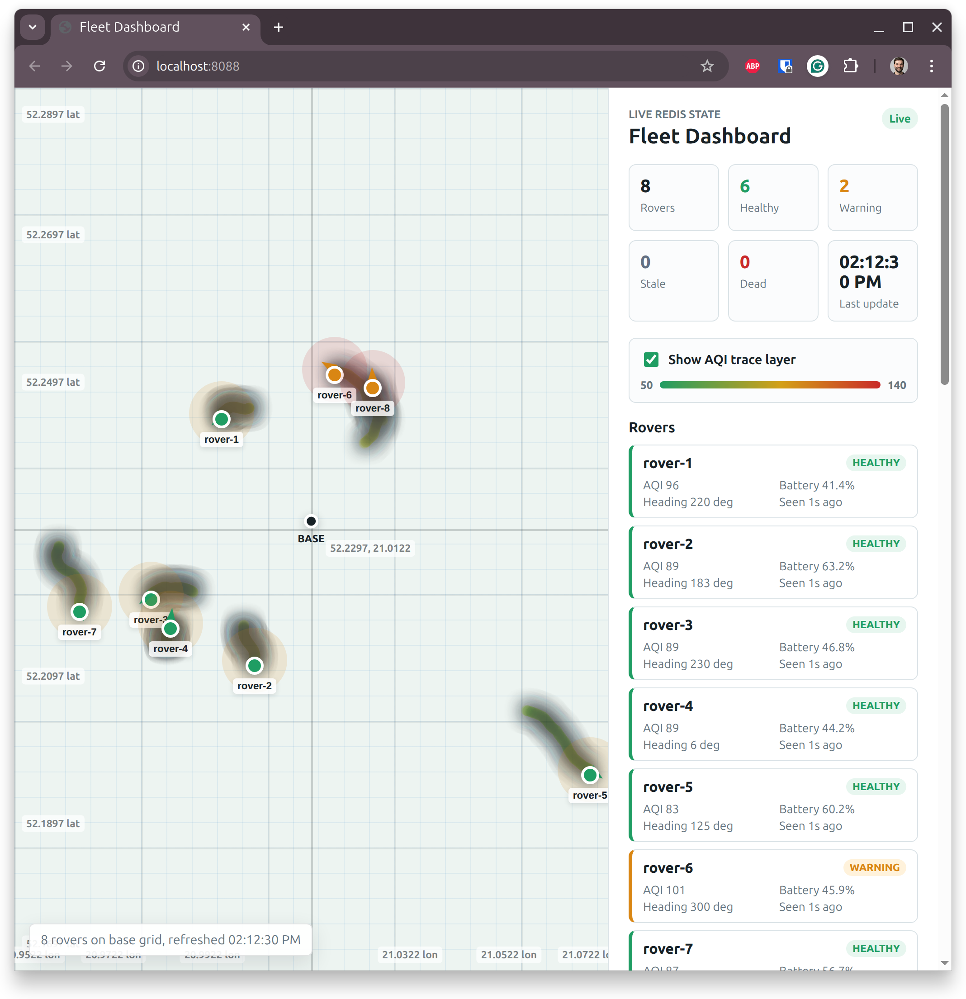
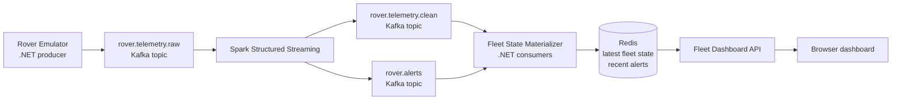
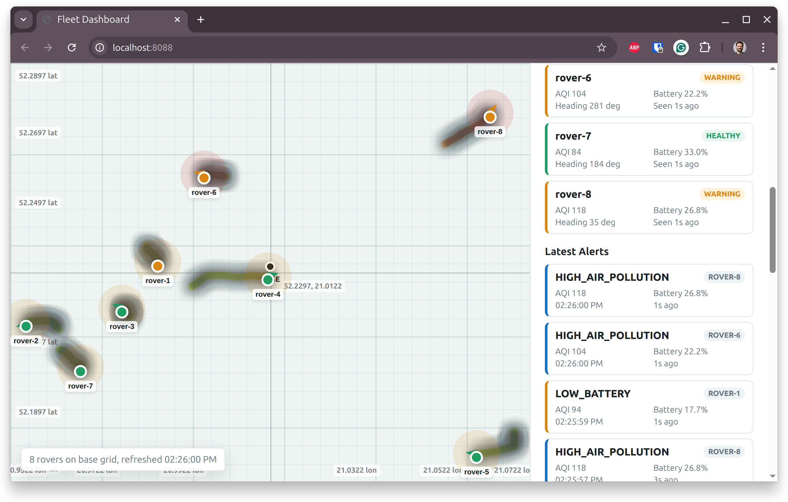
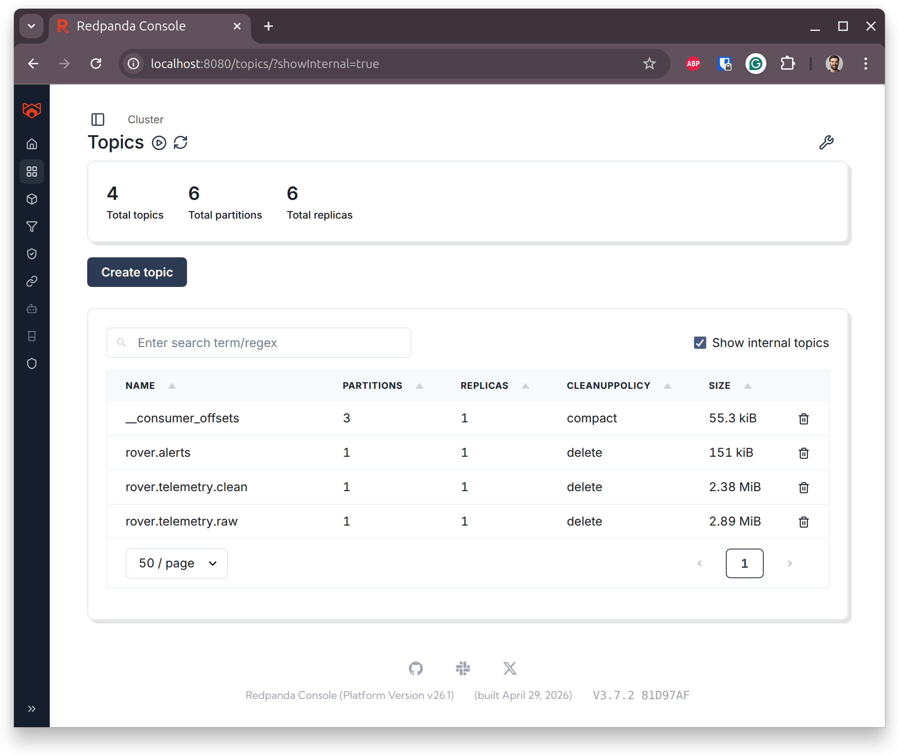
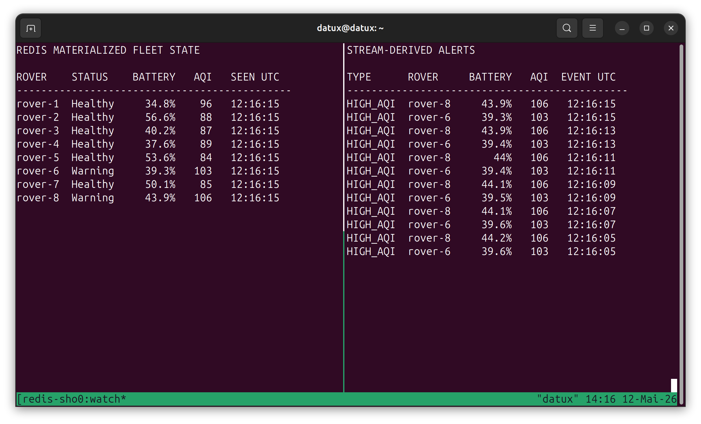

# Spark Learn

A compact learning playground for real-time telemetry processing with .NET, Kafka-compatible streaming, Spark Structured Streaming, Redis materialized state, and a live dashboard.



## Contents

- [What This Project Is](#what-this-project-is)
- [Demo At A Glance](#demo-at-a-glance)
- [Architecture](#architecture)
- [Data Flow](#data-flow)
- [Screenshots](#screenshots)
- [Prerequisites](#prerequisites)
- [Run Locally](#run-locally)
- [Domain Model](#domain-model)
- [Components](#components)
- [Learning Notes](#learning-notes)
- [Future Improvements](#future-improvements)
- [Repository Map](#repository-map)

## What This Project Is

This repository is a small, local-first sandbox for learning how streaming systems fit together. It simulates a fictional rover fleet where each rover moves from a shared base station, emits live telemetry, drains battery, samples a smooth air-quality field, and eventually becomes unhealthy or dies.

The goal is not to build a production fleet platform. The goal is to make the moving parts concrete enough to discuss:

- how events flow through Kafka-compatible infrastructure
- where Spark Structured Streaming fits in a real-time pipeline
- how stream-derived events become queryable application state
- why Redis is useful for low-latency materialized views
- when Spark is useful, and when a simpler .NET-only pipeline would be enough

The current Spark job focuses on parsing, normalization, Kafka output topics, and simple alert derivation. Watermarking, event-time deduplication, Parquet history, and advanced anomaly detection are listed as future learning steps below.

## Demo At A Glance

| Area | Technology | Source |
| --- | --- | --- |
| Telemetry producer | .NET 9 Worker, Confluent Kafka producer | [RoverEmitterWorker.cs](./src/RoverEmulator/RoverEmitterWorker.cs) |
| Event bus | Redpanda, Kafka-compatible local broker | [docker-compose.yml](./docker-compose.yml) |
| Stream processing | Spark Structured Streaming | [rover-stream.scala](./spark/jobs/rover-stream.scala) |
| Materialized state | Redis | [FleetStateMaterializer.cs](./src/FleetStateMaterialization/FleetStateMaterializer.cs) |
| Dashboard API | ASP.NET Core minimal API | [FleetDashboard/Program.cs](./src/FleetDashboard/Program.cs) |
| Dashboard UI | Static HTML/CSS/JS | [index.html](./src/FleetDashboard/wwwroot/index.html), [app.js](./src/FleetDashboard/wwwroot/js/app.js), [site.css](./src/FleetDashboard/wwwroot/css/site.css) |
| Shared event contracts | .NET records | [Telemetry.Contracts](./src/Telemetry.Contracts) |

## Architecture



Spark owns stream-time parsing, normalization, and alert derivation. The .NET materializer consumes Spark output topics and writes the Redis read model. The dashboard stays intentionally simple: it reads Redis-backed HTTP APIs and renders the current fleet state.

## Data Flow

1. [RoverEmulator](./src/RoverEmulator) simulates rover movement, heading changes, battery drain, and air-quality sampling.
2. It publishes raw telemetry events to `rover.telemetry.raw`, keyed by `roverId`.
3. [Spark](./spark/jobs/rover-stream.scala) reads the raw Kafka topic, parses JSON, normalizes field names, and writes clean events to `rover.telemetry.clean`.
4. The same Spark job derives alert events for high air pollution and low battery, then writes them to `rover.alerts`.
5. [FleetStateMaterialization](./src/FleetStateMaterialization/FleetStateMaterializer.cs) consumes clean telemetry and alerts from Kafka.
6. Redis stores latest rover state, active rover IDs, and recent alerts.
7. [FleetDashboard](./src/FleetDashboard) exposes the state over HTTP and renders the live browser dashboard.

## Screenshots

### Live Fleet Map

The main dashboard view shows rover positions, AQI trace history, fleet health counters, and per-rover status.


### Dashboard With Alerts

The alert-focused dashboard view shows the same live fleet state with active stream-derived alerts visible in the side panel.



### Kafka Topics

Redpanda Console shows the Kafka-compatible topics used by the pipeline.



### Redis Materialized State

Redis holds the query-optimized state consumed by the dashboard: latest rover state and latest alerts.



## Prerequisites

- Docker and Docker Compose
- `curl` and `jq` for the local inspection commands

## Run Locally

```bash
docker compose up --build
```

Useful local URLs:

| Service | URL |
| --- | --- |
| Dashboard | http://localhost:8088 |
| Fleet state API | http://localhost:8088/api/fleet/state |
| Latest alerts API | http://localhost:8088/api/alerts/latest?take=20 |
| Redpanda Console | http://localhost:8080 |
| Redpanda broker | `localhost:9092` |
| Redis | `localhost:6379` |

Useful inspection commands:

```bash
curl -s http://localhost:8088/api/fleet/state | jq .
curl -s "http://localhost:8088/api/alerts/latest?take=10" | jq .
docker compose exec -T redis redis-cli --raw SMEMBERS fleet:rovers:active
docker compose exec -T redis redis-cli --raw GET fleet:rover:rover-1:latest | jq .
```

## Domain Model

The project uses a small set of event and state contracts shared across services:

| Contract | Purpose |
| --- | --- |
| [RoverTelemetryEvent](./src/Telemetry.Contracts/RoverTelemetryEvent.cs) | Raw event emitted by the rover emulator |
| [CleanRoverTelemetryEvent](./src/Telemetry.Contracts/CleanRoverTelemetryEvent.cs) | Normalized telemetry event emitted by Spark |
| [FleetAlert](./src/Telemetry.Contracts/FleetAlert.cs) | Stream-derived alert emitted by Spark |
| [RoverFleetState](./src/Telemetry.Contracts/RoverFleetState.cs) | Redis materialized view consumed by the dashboard |

Each raw telemetry event includes location, heading, speed, battery, air-quality index, rover liveness, sequence number, and trace metadata.

## Components

### Rover Emulator

[RoverEmitterWorker.cs](./src/RoverEmulator/RoverEmitterWorker.cs) runs as a hosted .NET service and publishes telemetry every two seconds. The simulation is intentionally small but useful for streaming experiments:

- [RoverMotionModel.cs](./src/RoverEmulator/RoverSimulation/RoverMotionModel.cs) advances heading, speed, position, battery, and sequence number.
- [AirQualityField.cs](./src/RoverEmulator/RoverSimulation/AirQualityField.cs) creates a smooth spatial AQI field around the base station.
- [RoverState.cs](./src/RoverEmulator/RoverSimulation/RoverState.cs) keeps mutable simulation state per rover.

### Redpanda / Kafka

[docker-compose.yml](./docker-compose.yml) runs Redpanda as the local Kafka-compatible broker.

| Topic | Producer | Consumer | Purpose |
| --- | --- | --- | --- |
| `rover.telemetry.raw` | Rover emulator | Spark | Raw simulated telemetry |
| `rover.telemetry.clean` | Spark | Fleet state materializer | Normalized latest-state events |
| `rover.alerts` | Spark | Fleet state materializer | Stream-derived operational alerts |

### Spark Streaming Job

[rover-stream.scala](./spark/jobs/rover-stream.scala) is the central Spark learning surface. It demonstrates:

- reading Kafka as a streaming source
- parsing JSON into a typed schema
- projecting a cleaner event shape
- writing stream output back to Kafka
- deriving a second alert stream from the same source
- checkpointing streaming queries under [spark/checkpoints](./spark/checkpoints)

### Fleet State Materializer

[FleetStateMaterializer.cs](./src/FleetStateMaterialization/FleetStateMaterializer.cs) consumes `rover.telemetry.clean` and `rover.alerts`, then writes Redis keys used by the dashboard.

Important Redis keys:

| Key | Shape | Purpose |
| --- | --- | --- |
| `fleet:rovers:active` | set | Active rover IDs |
| `fleet:rover:{roverId}:latest` | string JSON | Latest materialized state for one rover |
| `fleet:alerts:latest` | list | Recent alerts for the dashboard |
| `fleet:alert:{alertId}` | string JSON | Individual alert payload |

### Fleet Dashboard

[FleetDashboard](./src/FleetDashboard) is a small ASP.NET Core app with a static frontend. It exposes:

- `/health`
- `/api/fleet/state`
- `/api/alerts/latest?take=20`

The frontend in [app.js](./src/FleetDashboard/wwwroot/js/app.js) polls the API every two seconds, renders rover positions, keeps an AQI trace layer, updates status counters, and shows recent alerts.

## Learning Notes

This project is deliberately split so each technology has a clear job:

- .NET is responsible for simulation, Kafka producer/consumer integration, Redis materialization, and the HTTP dashboard.
- Spark is responsible for stream parsing, transformation, and derived alert streams.
- Kafka/Redpanda is responsible for buffering and topic-based event flow.
- Redis is responsible for fast queryable state for the UI.

That split makes it easier to discuss common real-time processing questions: event shape, partitioning by entity ID, stream checkpoints, latest-state materialization, freshness, and operational alerting.

## Future Improvements

The current implementation is intentionally small. Good next learning steps:

- Add Spark watermarking and event-time deduplication by `eventId`.
- Write historical telemetry to Parquet under [spark/lake](./spark/lake).
- Move stale rover detection fully into the streaming layer.
- Add impossible-jump detection from speed, heading, and previous position.
- Add Docker healthchecks and startup readiness checks.
- Add integration tests for Kafka-to-Redis materialization.
- Replace dashboard polling with SignalR.
- Add Prometheus/Grafana or OpenTelemetry for pipeline observability.

## Repository Map

```text
.
├── docker-compose.yml
├── spark/
│   ├── jobs/rover-stream.scala
│   ├── checkpoints/
│   └── lake/
└── src/
    ├── RoverEmulator/
    ├── FleetStateMaterialization/
    ├── FleetDashboard/
    └── Telemetry.Contracts/
```
